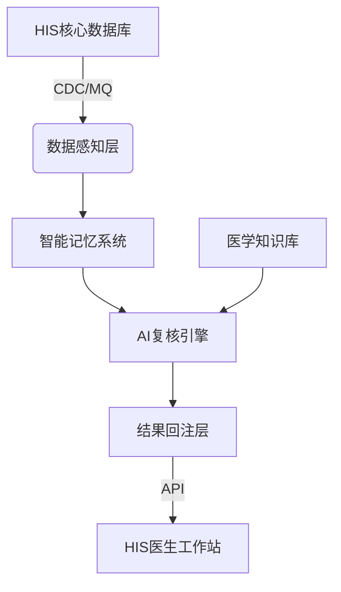

# 基层HIS智能安全复核引擎：开发实现指南

## 1. 项目背景与目标

为基层医生构建一个**无声的AI质检员**，在不改变原有HIS操作流程的前提下，实时分析诊断和处方行为，进行**三级递进式**安全复核：
- **第一级（刚性阻断）**：拦截绝对错误。
- **第二级（柔性提醒）**：提示潜在风险。
- **第三级（隐匿洞察）**：识别时间轴上的隐匿趋势。

**核心原则**：低侵入、高容错、快响应，不增加医生额外点击。

## 2. 系统技术架构

采用**旁路监听 + 智能记忆 + 结果回注**的松耦合架构，组件如下：

- **数据感知层**：通过HIS的CDC或消息队列（MQ）获取病历、处方、检验数据变更。
- **智能记忆系统**：三层记忆结构（工作/近期/长期），为AI引擎提供毫秒级全景患者快照。
- **AI复核引擎**：融合规则引擎、知识库、大语言模型，分层执行复核逻辑。
- **结果回注层**：通过HIS API将阻断弹窗、侧边栏提醒、待办任务列表写入前端。



## 3. 智能记忆系统详细规格

这是整个系统的**高性能核心**，必须优先实现。

### 3.1 分层记忆模型

| 记忆层 | 类比 | 功能 | 存储位置 | 数据形式 | 生命周期 |
| :--- | :--- | :--- | :--- | :--- | :--- |
| **工作记忆** | 当下对话 | 快存本次就诊实时数据 | Redis（内存） | JSON文档 | 本次就诊结束 |
| **近期记忆** | 最近状况 | 预加工的临床摘要档案 | Redis | 结构化摘要JSON | 30-90天，每日更新 |
| **长期记忆** | 老底子档案 | 固化的核心医学事实 | MySQL/PostgreSQL | 关系型表 | 永久，事件触发更新 |

### 3.2 工作记忆（Working Memory）

- **生成时机**：医生打开患者病历，系统初始化一个Session，从近期记忆和长期记忆**预加载**基线数据，并随本次录入实时追加。
- **数据结构示例**：
```json
{
  "session_id": "SESS_20240315_001",
  "patient_id": "P12345",
  "started_at": "2024-03-15T08:30:00Z",
  "current_diagnosis": ["急性上呼吸道感染"],
  "current_prescriptions": [
    {"drug_name": "阿莫西林胶囊", "dose": "0.5g tid"}
  ],
  "preloaded_profile": {
    "long_term_allergies": ["青霉素G"],
    "recent_lab_trend": { "eGFR": [78,76,73] }
  }
}
```
- **淘汰策略**：会话存档后立即清除内存占用，关键信息回写近期记忆。

### 3.3 近期记忆（Recent Memory）

- **核心思想**：**提前计算**，代替实时Join。
- **内容**：由离线任务每日（或每4小时）生成的《患者近期临床摘要档案》。
- **档案结构定义**（作为API返回快照的固定部分）：
```json
{
  "patient_id": "P12345",
  "last_3_visits_summary": [
    { "date": "2024-03-01", "main_diag": "高血压", "key_action": "增加氨氯地平" }
  ],
  "vital_trends": {
    "blood_pressure": [{"date":"2024-03-01","sys":148},{"date":"2024-03-14","sys":135}]
  },
  "lab_abnormal_flags": ["低血钾：3.2mmol/L (2024-03-10)"],
  "current_active_drugs": ["氨氯地平5mg", "二甲双胍0.5g"]
}
```
- **生成方法**：一个Spark或Python定时脚本，读取HIS库中的Visits、Diagnoses、Prescriptions、LabResults表，按患者聚类，提取摘要。

### 3.4 长期记忆（Long-term Memory）

- **内容**：只有经过严格确认的核心事实。
- **数据库表设计示例**：
```sql
CREATE TABLE patient_long_term_facts (
    patient_id VARCHAR PRIMARY KEY,
    severe_allergies JSON,          -- ["青霉素过敏性休克", "磺胺类-皮疹"]
    chronic_diseases JSON,          -- ["2型糖尿病", "高血压病3级"]
    critical_physiology JSON,       -- {"G6PD缺乏": true, "肾功能分期": "CKD3期"}
    surgical_history JSON,          -- [{"name":"冠脉支架植入","year":2020}]
    updated_at TIMESTAMP
);
```
- **更新规则**：仅由以下事件触发：
  1. 医生在HIS中更新“过敏史”模块 → 通过MQ通知记忆服务刷新。
  2. 诊断接口出现新慢病代码 → 需在一定周期内出现≥2次才自动升级为长期记录。
  3. **禁止AI自动修改过敏史和手术史**。

### 3.5 记忆生命周期管理器（Memory Orchestrator）

用事件驱动状态流转：

| 事件 | 行为 |
| :--- | :--- |
| **患者接诊** (`encounter.start`) | 将长期记忆+近期记忆加载至Redis工作区；创建新的工作记忆文档。 |
| **诊疗操作** (`data.submit`) | 新诊断/处方追加到工作记忆，并立刻供后端AI复核调用。 |
| **就诊结束** (`encounter.end`) | 清理Redis工作记忆；抽取本次摘要发送到近期记忆生成任务队列。 |
| **日终批处理** (`cron.daily`) | 为所有有变更的患者重新生成近期记忆摘要并写入Redis。 |

## 4. AI复核引擎逻辑实现

引擎从记忆系统拿到**全景患者快照**后，执行三层判断。

### 4.1 第一级：刚性规则阻断

**技术**：单纯规则引擎（Drools或硬编码逻辑）。
**输入**：工作记忆中的本次诊断、处方 + 患者长期记忆中的`severe_allergies`、`critical_physiology`。
**规则包（硬编码示例）**：
```python
def rigid_check(working, longterm):
    alerts = []
    # 青霉素过敏拦截
    if "青霉素过敏性休克" in longterm.get("severe_allergies", []):
        for drug in working["current_prescriptions"]:
            if drug["drug_name"] in ["阿莫西林","青霉素V钾"]:
                alerts.append({"level": "block", "msg": "患者有青霉素过敏性休克史，处方含阿莫西林，禁止提交！"})
    # 诊断-性别冲突
    if working["current_diagnosis"] == "盆腔炎" and patient.gender == "男":
        alerts.append({"level": "block", "msg": "诊断盆腔炎与性别不符"})
    return alerts
```
**前端输出**：直接弹出强制性阻断窗口，需医生明确修改或录制突破理由。

### 4.2 第二级：柔性风险提示

**技术**：LLM提示词 + 知识库验证。必须给出低延迟，推荐使用经微调的7B本地模型。
**输入**：工作记忆 + 近期记忆摘要档案 + 本地药品说明书/指南向量库。
**Prompt设计框架**：
```
你是基层医疗安全复核助手。基于以下患者全景信息，找出潜在药学监护或检查缺失风险，用一句话指出风险和建议，语气友善、不强制。

【患者长期情况】{长期记忆事实}
【近期临床摘要】{近期记忆JSON}
【本次诊疗行为】{工作记忆JSON}

请找出2条以内最重要的风险点，若无则输出“无”。格式：[风险描述]。[建议]。
```
**结果处理**：AI返回文本后，系统自动关联匹配原HIS中的医嘱项ID，方便医生一键采纳。
**前端输出**：工作站侧边栏出现数字红点，点开后显示风险卡片，卡片上有“采纳”“忽略”按钮。

### 4.3 第三级：隐匿趋势洞察

**技术**：批处理任务（每天凌晨执行），调用大模型分析所有活跃患者的近期记忆变化。
**输入**：每个患者近6个月的近期记忆档案（时间序列）。
**探测定式（可包含在Prompt中）**：
- 同一主诉多次就诊，但检查指标进行性变差（如血红蛋白逐月下降）。
- 药物间的矛盾作用（如A药升高血压，B药降低血压，但近期血压异常波动）。
**输出**：生成一个**医生早上看到的待办列表**，每条包含患者姓名、异常摘要、建议。
**前端输出**：在HIS首页开辟“今日重点关注”区域，点击可查看详情并标记“已处理”“发起随访”。

## 5. 开发路线图与里程碑

### 阶段一：核心记忆系统与刚性阻断（MVP，2-3周）
- [ ] 搭建Redis+MongoDB基础设施。
- [ ] 实现三个记忆层级的数据模型和CRUD操作。
- [ ] 开发HIS接口对接模块（患者接诊、提交处方事件接入）。
- [ ] 完成5条最高频刚性规则（过敏、诊断性别、严重剂量）的编码和前端弹窗。
- **验收标准**：医生开具有青霉素过敏史患者的阿莫西林时，80ms内弹出阻断框。

### 阶段二：柔性提醒上线（4-6周）
- [ ] 部署本地大模型（如Qwen2-7B）或云端API，设计Prompt模板。
- [ ] 构建本地药品知识库（嵌入向量化）。
- [ ] 实现大模型输出到HIS医嘱的关联解析。
- [ ] 完成侧边栏提醒卡片的前端交互开发。
- **验收标准**：开利尿剂后若近期无电解质检查，提醒出现率>95%；医生采纳率基准线>30%。

### 阶段三：趋势洞察与全科室推广（8-12周）
- [ ] 开发每日批次患者摘要生成与对比分析任务。
- [ ] 构建“今日重点关注患者”列表前端页面。
- [ ] 开展3个科室UAT，收集反馈，优化提示语言和频次。

## 6. 与现有HIS的接口定义（必须HIS侧提供）

- **患者信息快照接口**（若无，需HIS提供基础数据视图权限）：
  - `GET /api/patient/{id}/allergy` → List<Allergy>
  - `GET /api/patient/{id}/chronicDisease` → List<Disease>
- **业务事件订阅**（代替接口）：
  - 建议HIS在保存诊断、处方、检验报告时，发送Kafka消息，我方订阅Topic。
- **消息回写接口**（我方提供给HIS）：
  - `POST /api/cds/alerts` → HIS主动拉取或我方推送待处理提醒。
  - `POST /api/cds/block` → 我方返回当前处方是否应刚性阻断，HIS据此决定前端执行。

